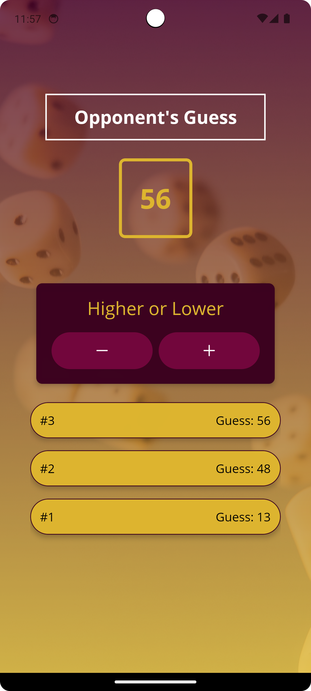

# 🎮 Guess My Number - React Native

Um jogo interativo onde o celular tenta adivinhar o número escolhido pelo usuário. Desenvolvido em React Native como parte do um curso React Native - The Practical Guide na Udemy.

## 📌 Sobre o Jogo

O jogo funciona da seguinte forma:

1. O usuário escolhe um número.
2. O celular tenta adivinhar o número e o usuário informa se o palpite é **maior** ou **menor** do que o número escolhido.
3. O jogo continua até que o celular acerte o número.
4. A quantidade de tentativas é exibida no final da partida.

## 📸 Screenshots
<p align="center">
  
  
  
</p>

## 🚀 Como Executar

### Pré-requisitos:

- Node.js instalado
- Expo CLI configurado

### Passos:

1. Clone este repositório:

```bash
git clone https://github.com/pedester321/GuessMyNumberGame.git
cd Game
```

2. Instale as dependências:

```bash
npm install
```

3. Inicie o aplicativo:

```bash
npm start
```

Ou, se estiver usando Expo:

```bash
expo start
```

4. Escaneie o QR Code com o aplicativo Expo Go no celular ou use um emulador.

## 🛠 Tecnologias Utilizadas

- **React Native** - Para criar a interface e lógica do jogo
- **Expo** - Para facilitar o desenvolvimento e execução
- **JavaScript** - Linguagem principal

## 📝 Licença

Este projeto está licenciado sob a licença MIT.

---

Desenvolvido por Pedro Castro como parte do curso React Native - The Practical Guide na Udemy.
